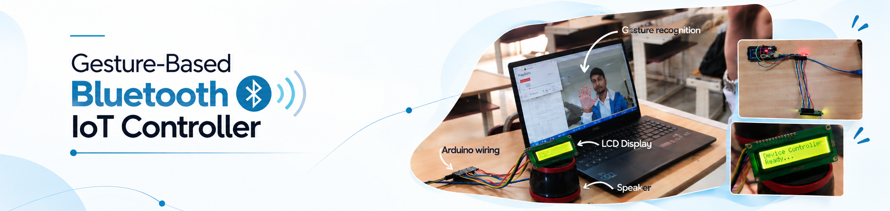

  

## Overview

This project allows you to **control media playback (play/pause, next, previous)** of a bluetooth speaker using **hand gestures**, detected via a webcam using **MediaPipe**, and sends commands to an **Arduino**, which in turn provides **visual feedback** on an LCD.

## Components Used
* Arduino Mega 2560
* HW-61 I2C module
* RG1602A 16x2 LCD Display
* Jumper Wires
* Camera (via Laptop Computer)

## Working

* The gestures shown by hand are recognized by the computer webcam. 
* The Python interprets it and then sends it to the Arduino.
* Arduino decides which media action to perform and sends it back to the bluetooth of the computer
* Bluetooth sends the signal of performing the action to a speaker connected to the computer through bluetooth.
* Also, the action that is performed is visible on the LCD display connected to the Arduino.

## Software Components 

### Python Libraries Used:

* **MediaPipe** – Detects hand and finger positions.
* **OpenCV** – Captures and displays video frames.
* **PyAutoGUI** – Simulates media key presses (e.g., play/pause).
* **Serial** – Communicates with Arduino.

### Arduino Header Files:

* **Wire.h** - Prebuilt library that enables I2C (Inter-Integrated Circuit) communication between devices.
* **LiquidCrystal_I2C.h** - Arduino library for controlling I2C-enabled LCD displays.

## Gesture Recognition Logic (Python)

The webcam captures hand gestures and interprets them as:

1. **Open Palm** → `Play/Pause`

   * All fingers extended.
   * Thumb extended to the side.

2. **Thumb Left + Fingers Curled** → `Previous Track`

   * Thumb extended leftward.
   * Other fingers curled (tips below joints).

3. **Thumb Right + Fingers Curled** → `Next Track`

   * Thumb extended rightward.
   * Other fingers curled.

## Code Flow

1. Capture each frame via webcam.
2. Detect hand landmarks using MediaPipe.
3. Match landmark positions to gesture logic.
4. Use `pyautogui` to simulate keypresses:

   * `"playpause"` → Media play/pause
   * `"nexttrack"` → Next song
   * `"prevtrack"` → Previous song
5. Send a corresponding command (`P`, `N`, or `B`) to Arduino via serial.

## Hardware Components

### Arduino:

Receives a character via serial (`P`, `N`, or `B`) and displays corresponding text on a 16x2 I2C LCD.

### I2C LCD Display:

Show feedback of the media action performed by the Arduino.

### Commands Handled:

* `'P'` → Displays `"Playback initiated/paused"`.
* `'N'` → Displays `"Next Track"`.
* `'B'` → Displays `"Previous"`.

### Output:

LCD feedback confirms action (helpful in case of gesture misinterpretation).
Can be extended to show currently playing media information.

## Integration

* The **Python script** handles gesture recognition and control.
* The **Arduino sketch** sends the command to the bluetooth speaker.
* **Serial communication** bridges both systems in real time.
* The **LCD** diplays the action performed.

## Workflow

Gesture → Detected by webcam → Python interprets → Media action triggered by Arduino → LCD displays status

**Example:** 

* You show an open palm → Your music pauses → LCD shows “Playback initiated/paused”

## Application 

In terms of practical use, it's more of a niche product than an everyday essential. However, it has the potential to be transformed into a compact device equipped with a camera, allowing you to control music playback with just a flick of the hand, without the need to go back to the speaker repeatedly. 
